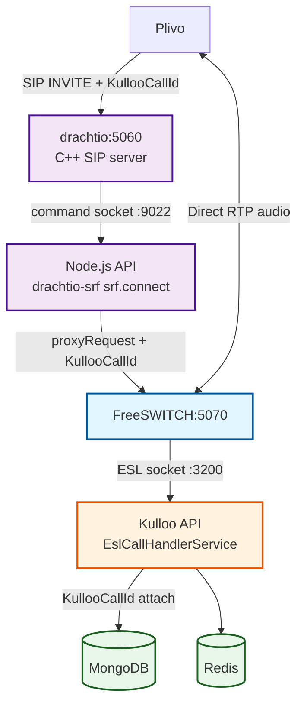
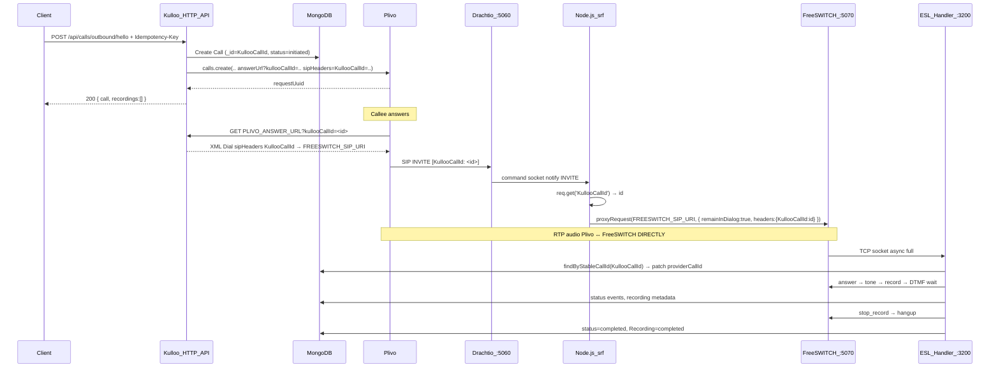
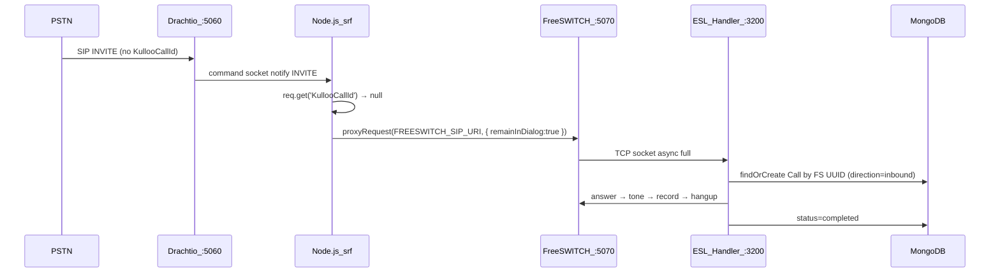

# Drachtio in Kulloo (Flow B)

> **Doc hub:** [Documentation index](../README.md) — see also [kamailio.md](./kamailio.md), [freeswitch.md](./freeswitch.md), [esl.md](./esl.md).

This document describes **Flow B** — an optional Drachtio-based SIP signaling path that replaces Kamailio while keeping FreeSWITCH, ESL, MongoDB, and Redis identical to Flow A.

Flow B is **opt-in**. Flow A (Kamailio) remains the default and is not affected.

---

## 1. Flow A vs Flow B at a glance

| Aspect | **Flow A** (default) | **Flow B** (opt-in) |
|--------|----------------------|----------------------|
| **Activation** | `CALL_CONTROL_BACKEND=kulloo` (or unset) | `CALL_CONTROL_BACKEND=drachtio` |
| **SIP signaling** | Kamailio (C, config-driven) | Drachtio (C++ server + Node.js `drachtio-srf`) |
| **SIP load balancing** | Kamailio `dispatcher` module | Single FreeSWITCH target (extend in `drachtio-sip-handler.service.ts`) |
| **Media / RTP** | FreeSWITCH (unchanged) | FreeSWITCH (unchanged) |
| **ESL (port 3200)** | `EslCallHandlerService` (unchanged) | `EslCallHandlerService` (unchanged) |
| **MongoDB models** | `Call`, `CallEvent`, `Recording` | Same — zero change |
| **Redis** | Idempotency + webhook dedupe | Same — zero change |
| **HTTP routes** | All `/api/*` routes | Same — zero change |
| **KullooCallId** | Passed through by Kamailio `t_relay()` | Passed through by `srf.proxyRequest()` |
| **Docker** | `docker-compose.kamailio.yml` | `docker-compose.drachtio.yml` |

---

## 2. Architecture diagram (Flow B)

> [!NOTE]
> **RTP flows directly between Plivo and FreeSWITCH — Drachtio never touches audio.**
> This is identical to Kamailio's behaviour in Flow A.



---

## 3. How KullooCallId survives the Drachtio hop

The `KullooCallId` header is the stable spine that ties a Mongo `Call` document to the FreeSWITCH ESL session. It must survive every SIP hop — same requirement as in Flow A.

> [!IMPORTANT]
> **Key Insight:** In Flow A, Kamailio uses `t_relay()` which forwards **ALL headers untouched**.
> In Flow B, `srf.proxyRequest()` is called with `headers: { KullooCallId: value }` to explicitly replicate this pass-through.

**Step-by-step (outbound API-initiated call):**

1. Kulloo API creates `Call._id = 507f1f77bcf86cd799439011` (24-hex ObjectId)
2. `TelephonyAdapter` calls Plivo REST:
   `sipHeaders = "KullooCallId=507f1f77bcf86cd799439011"`
   → Plivo puts this in the SIP INVITE header: `KullooCallId: 507f1f77bcf86cd799439011`
3. Plivo hits Answer URL → `sendPlivoAnswerXml` returns:
   ```xml
   <Dial sipHeaders="KullooCallId=507f1f77bcf86cd799439011">
     <User>FREESWITCH_SIP_URI</User>
   </Dial>
   ```
   → Plivo sends SIP INVITE to drachtio:5060 with `KullooCallId` header
4. drachtio C++ server receives the INVITE, notifies Node.js app via command socket (:9022)
5. `DrachtioSipHandlerService.handleInvite()`:
   - `req.get('KullooCallId')` reads `507f1f77bcf86cd799439011`
   - `srf.proxyRequest(req, freeswitchTarget, { remainInDialog: true, headers: { KullooCallId: '507f1f77bcf86cd799439011' } })`
   → FreeSWITCH receives INVITE with `KullooCallId` header intact
6. FreeSWITCH dialplan: matches `1000` → `socket api:3200 async full`
7. ESL handler (`esl-call-handler.service.ts`):
   - `extractKullooCallId()` finds `KullooCallId` header (case-insensitive search — same code as Flow A)
   - `findCallDocumentByStableCallId('507f1f77bcf86cd799439011')`
   - Updates `Call` document: `providerCallId` = FreeSWITCH channel UUID
   - Runs hello flow: answer → tone → record → DTMF → hangup → completed

**Inbound DID (no KullooCallId):**
- Drachtio sees no `KullooCallId` header → proxies without it
- ESL runs `findOrCreateByProviderCallId()` → new `direction: "inbound"` Call row
- Behaviour identical to Kamailio Flow A inbound path

---

## 4. Two-component Drachtio architecture

Unlike Kamailio (single C process), Flow B uses two components:

| Component | What it is | Port |
|-----------|-----------|------|
| **drachtio C++ server** (`drachtio/drachtio-server` container) | The actual SIP engine. Receives SIP from Plivo. Does NOT process application logic. | UDP/TCP **5060** (SIP), TCP **9022** (command socket) |
| **Node.js app** (`drachtio-srf` library) | Application logic. Connects to the C++ server via the command socket. Reads headers, decides routing, calls `proxyRequest`. | Connects outbound to **9022** |

```
Plivo → [drachtio C++:5060] ↔ [Node.js:srf.connect(:9022)]
                                         ↓
                               [FreeSWITCH:5070]
                                         ↓
                               [ESL:3200 → Kulloo]
```

---

## 5. Sequence diagrams

### 5.1 Outbound (API-initiated call)



### 5.2 Inbound DID



---

## 6. `remainInDialog: true` — Drachtio's equivalent of Kamailio `record_route()`

In Flow A, Kamailio's `record_route()` ensures Kamailio stays in the signaling path for BYE and re-INVITE after the initial INVITE. This allows mid-call signaling (hold, transfer, etc.) to be handled cleanly.

In Flow B, `srf.proxyRequest(req, target, { remainInDialog: true })` achieves the same: Drachtio keeps itself in the SIP dialog so subsequent BYE and re-INVITE messages route through it.

---

## 7. Environment variables

| Variable | Required | Default | Purpose |
|----------|----------|---------|---------|
| `CALL_CONTROL_BACKEND` | No | `kulloo` | Set to `drachtio` to activate Flow B |
| `DRACHTIO_HOST` | Flow B | `drachtio` | Docker service name of the drachtio C++ container |
| `DRACHTIO_PORT` | Flow B | `9022` | **Command** port (Node → drachtio C++). NOT the SIP port. |
| `DRACHTIO_SECRET` | Flow B | `kulloo-drachtio-secret` | Shared secret between Node.js app and drachtio container |
| `DRACHTIO_SIP_PORT` | No | `5060` | SIP port (used in logs only; port mapping is in docker-compose) |
| `FREESWITCH_SIP_URI` | Flow B | — | FreeSWITCH SIP target for proxy (e.g. `sip:1000@<fs-ip>:5070`) |

> [!WARNING]
> `DRACHTIO_PORT=9022` is the **command socket** port. Do not confuse it with SIP port 5060. Plivo's SIP target must point at the drachtio container's IP/port **5060** — not 9022.

---

## 8. Port plan (Flow B)

| Service | Container Port | Host Port | Protocol | Notes |
|---------|---------------|-----------|----------|-------|
| drachtio (SIP) | `5060` | `5060` | UDP + TCP | Receives from Plivo/PSTN |
| drachtio (command) | `9022` | `127.0.0.1:9022` | TCP | Node.js srf.connect() — loopback only |
| FreeSWITCH fs1 | `5070` | `5070` | UDP + TCP | Target for Drachtio proxyRequest |
| Kulloo API | `5000` | `5000` | TCP | HTTP API (unchanged) |
| ESL outbound | `3200` | `3200` | TCP | All FS instances connect here (unchanged) |

---

## 9. Running Flow B

**`Docker/` default stack + Drachtio overlay** (from repo root — your usual Kamailio compose stays the base file):

```bash
docker pull drachtio/drachtio-server:latest

docker compose \
  -f Docker/docker-compose.yml \
  -f Docker/docker-compose.drachtio.yml \
  up -d --build

# Do not enable Kamailio’s profile while using this overlay (port 5060 conflict).
```

**Repo-root alternate** (same idea as `docker-compose.server.yml` + overlay):

```bash
docker compose \
  -f docker-compose.server.yml \
  -f docker-compose.drachtio.yml \
  up -d

# Do NOT add docker-compose.kamailio.yml — Kamailio is not used in Flow B.
```

**Update Plivo:** Point your Plivo application's SIP Destination to `sip:1000@<your-host>:5060` (Drachtio) instead of Kamailio.

---

## 10. Source file map

| Area | Path |
|------|------|
| SIP INVITE handler | `backend/src/services/drachtio/drachtio-sip-handler.service.ts` |
| Drachtio C++ connection | `backend/src/services/drachtio/drachtio.client.ts` |
| Backend strategy interface | `backend/src/services/call-control/call-control-backend.interface.ts` |
| Flow A wrapper | `backend/src/services/call-control/kulloo-backend.ts` |
| Flow B wrapper | `backend/src/services/call-control/drachtio-backend.ts` |
| Backend factory | `backend/src/services/call-control/call-control-backend.factory.ts` |
| Bootstrap wiring | `backend/src/server.ts` |
| Env vars | `backend/src/config/env.ts` |
| Type declarations | `backend/src/types/drachtio.d.ts` |
| Docker compose | `Docker/docker-compose.drachtio.yml` (merge with `Docker/docker-compose.yml`); or root `docker-compose.drachtio.yml` + `docker-compose.server.yml` |

---

## 11. Related documentation

- [kamailio.md](./kamailio.md) — Flow A: Kamailio SIP load balancer (default)
- [esl.md](./esl.md) — ESL outbound socket (shared by both flows)
- [freeswitch.md](./freeswitch.md) — FreeSWITCH config (shared by both flows)
- [inbound-call-dataflow.md](./inbound-call-dataflow.md) — Inbound DID flow
- [outbound-calls.md](./outbound-calls.md) — Outbound API + KullooCallId

---

*Flow B: Drachtio replaces Kamailio at the SIP signaling layer only. FreeSWITCH, ESL, MongoDB, Redis, and all HTTP routes are identical in both flows.*
