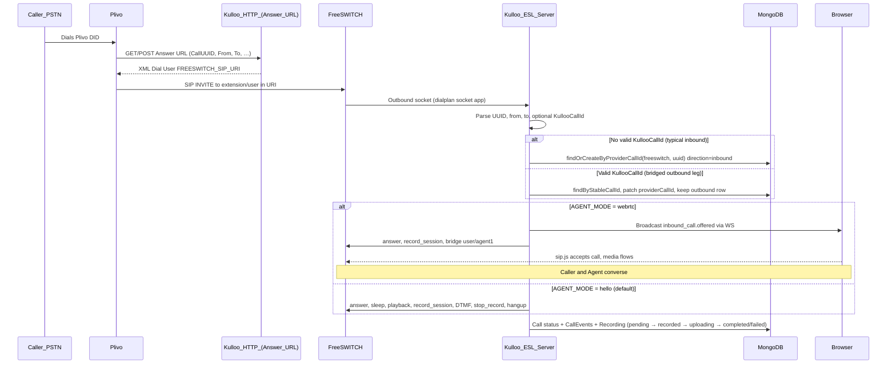

# Inbound calls (Kulloo)

> **Doc hub:** [Documentation index](../README.md) — pair with [outbound-calls.md](./outbound-calls.md) and [esl.md](./esl.md).

This document describes how **inbound** PSTN/SIP calls reach Kulloo, how they differ from **outbound**, and the **data flow** from the carrier edge through FreeSWITCH to MongoDB. It matches the current backend under `backend/` and the ESL handler in `esl-call-handler.service.ts`.

---

## 1. What “inbound” means here

**Inbound** = media is offered to your **FreeSWITCH** node first (or bridged there from Plivo), and Kulloo **does not** create the `Call` document until **ESL** runs.

Typical production path today:

1. A caller dials your **Plivo number** (DID). Plivo runs your **XML Application** and requests your **Answer URL** on Kulloo.
2. Kulloo returns Plivo XML that **`<Dial>`**s into `FREESWITCH_SIP_URI` (e.g. `sip:1000@<your-fs-public-ip>`).
3. **SIP** lands on FreeSWITCH; the dialplan hits the `mrf` context and runs the **`socket`** application.
4. FreeSWITCH opens an **outbound Event Socket** TCP connection to Kulloo (`ESL_OUTBOUND_PORT`, commonly **3200**).
5. Kulloo’s ESL server accepts the socket, parses channel identity (from/to, UUID), optionally reads **`KullooCallId`** if this leg is really an **outbound bridge** carrying that header (see below), then runs **`executeCallFlow`**.

There is **no** dedicated HTTP route like “`POST /api/calls/inbound`”. The **telephony edge** is either **Plivo** (HTTP Answer URL) or, in a future SIP-trunk-only setup, **SIP straight to FreeSWITCH**—either way, **Mongo state starts** when ESL connects.

---

## 2. Inbound vs outbound (same ESL, different `Call` creation)

| Aspect | **Inbound** (this doc) | **Outbound** ([outbound-calls.md](./outbound-calls.md)) |
|--------|-------------------------|----------------------------------------|
| Who creates `Call` first | ESL (`findOrCreateByProviderCallId`) | `POST /api/calls/outbound/hello` before Plivo dials |
| `direction` | `"inbound"` | `"outbound"` (patched when ESL attaches) |
| Stable id before media | None (Mongo `_id` appears when ESL runs) | `Call._id` / `callSid` exists before dial |
| `KullooCallId` on SIP | Usually **absent** (pure DID inbound) | Set on `calls.create` + Answer URL for attach |
| `providerCallId` | FreeSWITCH **channel UUID** | FS UUID after attach; `pending-<callSid>` before |

The actual media execution depends on **`AGENT_MODE`**:
* **`AGENT_MODE=hello` (default):** Runs the automated hello script (answer → tone → record → DTMF 1 early stop → stop record → hangup).
* **`AGENT_MODE=webrtc`:** Runs the agent bridge (broadcasts WS event to frontend → answers → starts recording → bridges caller to agent WebRTC browser).

In both modes, **how** the `Call` row is initially created and correlated remains identical.

---

## 3. End-to-end data flow (Plivo DID → FreeSWITCH → ESL)



---

## 4. HTTP: Plivo Answer URL (inbound edge only)

Routes (same handler): **`ANY /plivo/answer`**, **`ANY /api/plivo/answer`**.

Behavior (`app.ts` → `sendPlivoAnswerXml`):

1. Reads `FREESWITCH_SIP_URI`. If missing, returns spoken error XML + hangup.
2. Optionally extracts **`kullooCallId`** (24-char hex) from query/body (`KullooCallId`, `X-PH-KullooCallId`, etc.).
3. Returns:

```xml
<Response>
  <Dial sipHeaders="KullooCallId=...">   <!-- only if kullooCallId present -->
    <User>FREESWITCH_SIP_URI</User>
  </Dial>
</Response>
```

For **pure inbound DID** traffic you typically **omit** `KullooCallId`; ESL then treats the session as **inbound** (see §2). If `kullooCallId` is missing, Kulloo logs `plivo_answer_missing_kulloo_call_id` — that is **expected** for simple inbound; it is **not** OK for the outbound API path where you must correlate to a pre-created `Call`.

**Hangup URL:** `POST /plivo/hangup` and `POST /api/plivo/hangup` return a trivial JSON ack; terminal state for recordings is still driven by **ESL** and recovery jobs.

---

## 5. FreeSWITCH: dialplan → outbound ESL

Example (`freeswitch/conf/dialplan/hello.xml`): for `destination_number` matching **`1000`** or **`hello`**, run:

```xml
<action application="socket" data="<kulloo-host-or-ip>:3200 async full"/>
```

Deployment must set the **host/IP** and expose **`ESL_OUTBOUND_PORT`** from the Kulloo process (e.g. published TCP port **3200** on the VPS / Dokploy).

---

## 6. ESL handler: handshake, identity, and flow

File: `backend/src/services/freeswitch/esl-call-handler.service.ts`.

1. **Connection:** `modesl.Server` accepts the socket from FreeSWITCH.
2. **Channel data:** On `esl::ready`, reads `getInfo()` headers; may refine from `CHANNEL_DATA` within ~250ms.
3. **Subscriptions:** `conn.send("myevents")`; later `event plain DTMF` / `CHANNEL_DTMF` for digits.
4. **Identity fallbacks:** If From/To are missing, **`getvar`** on the channel (`effective_caller_id_number`, `destination_number`, etc.) and optional **`uuid`** correction.
5. **`KullooCallId`:** Parsed from headers or vars (e.g. `sip_h_X-PH-KullooCallId`). If it is a valid 24-hex id and a `Call` exists, ESL **attaches** to that document (outbound-bridge case). Otherwise **`findOrCreateByProviderCallId("freeswitch", channelUuid)`** with **`direction: "inbound"`**.
6. **Media execution:** Splits based on environment config:
   * **`hello` mode**: `answer` → short `sleep` → `playback` (tone) → `recording_started` + **`Recording` row `pending`** → `record_session` → wait up to 20s or **DTMF `1`** → `stop_record_session` → **`handleRecordingComplete`** → `hangup` → `completed` + events.
   * **`webrtc` mode**: `inbound_call.offered` WebSocket broadcast sent to frontend → `answer` → `record_session` → FreeSWITCH `bridge` action to `user/agent1@...` → call remains bridged until caller or agent hangs up → `stop_record_session` → `handleRecordingComplete` → `call.ended` broadcast.

**Failure path:** Timeouts on ESL steps → `failAndHangup` → `Call` **`failed`**, `failedCalls` metric, best-effort hangup.

---

## 7. MongoDB: what gets stored (inbound)

### `Call`

- Created when ESL runs (unless attached via `KullooCallId`).
- **`direction: "inbound"`**, **`provider: "freeswitch"`**, **`providerCallId`**: FS channel UUID.
- **`correlationId`**: generated in `executeCallFlow` (`randomUUID()`) for that session — **not** the same as Express `X-Correlation-Id` on the Answer URL request (those are separate HTTP requests).
- **`from` / `to`**, **`fromRaw` / `toRaw`**, **`fromE164` / `toE164`**, **`callerName`**: from channel headers/vars when available.
- **Status progression:** `received` → `answered` → `played` → `recording_started` → `hangup` → `completed` (or `failed` on errors).
- **Idempotency:** Unique sparse index on `{ provider, providerCallId }` prevents duplicate rows for the same FS UUID.

### `CallEvent`

- Examples: `received`, `answered`, `played`, `recording_started`, `dtmf`, `hangup`, `completed`, `failed`, `recording_failed`, `recording_completed`.

### `Recording`

- **`providerRecordingId`**: same as FS UUID (WAV basename).
- **`status`**: `pending` when recording starts; then **`recorded`** after **`handleRecordingComplete`** confirms file size **> 44 bytes** (non-empty WAV). If S3 is configured it transitions `uploading → completed` and deletes the local WAV. Failures end in **`failed`** with a `recording_failed` event.

### `Users`

- Not part of the inbound hello path; unchanged by this flow.

---

## 8. Recordings on disk and HTTP

- WAV path: **`RECORDINGS_DIR`/`{channelUuid}.wav`** (inside containers, often shared volume with FreeSWITCH).
- List/stream: **`GET /api/recordings/local`**, **`GET /api/recordings/local/:callUuid`** (see [api.md](../reference/api.md)).

If backend and FreeSWITCH use **different** directories, the API can list **empty** while FS has files — use one shared mount in production.

---

## 9. Recovery and consistency (inbound-relevant)

Started from `server.ts`:

| Mechanism | Purpose |
|-----------|---------|
| **Orphan call sweep** (`ORPHAN_GRACE_MS`, `ORPHAN_SWEEP_INTERVAL_MS`) | Marks stale non-terminal calls (e.g. backend restarted mid-call) |
| **Recordings sync** (`RECORDINGS_SYNC_GRACE_MS`, `RECORDINGS_SYNC_INTERVAL_MS`) | Backfills `Recording` rows from WAV files on disk |

Stability and operations notes live in [../ops/stability.md](../ops/stability.md).

### Redis (`REDIS_URL`, required)

Redis is **not** on the Plivo → Answer URL → FreeSWITCH → ESL path itself (no Redis lookup during ESL). The API **requires** Redis at startup. It **does** affect **HTTP recording webhooks** when you use provider-hosted recording callbacks:

- **`POST /api/calls/callbacks/plivo/recording`**, **`…/twilio/recording`**, **`…/freeswitch/recording`** — duplicate deliveries of the **same** callback identity are answered with **`200`** and `{ success: true, duplicate: true }` without re-running ingestion (`SET … NX` with TTL). See [redis.md](../reference/redis.md).

The **primary** inbound hello recording path here is **FreeSWITCH WAV + ESL**; Plivo/Twilio recording callbacks matter when you integrate those providers’ recording webhooks for the same or other flows.

---

## 10. Observability

- HTTP: **`X-Correlation-Id`** on Plivo Answer requests (Express middleware).
- ESL logs: structured fields such as `callId`, `callSid`, `channelUuid`, `correlationId` (from the **Call** document once known).
- **`GET /api/metrics`**: active calls, failed calls, recording failures, DTMF count; also **`redisIdempotencyHits`**, **`redisIdempotencyMisses`**, **`webhookDedupeSkips`** (see [redis.md](../reference/redis.md)).
- **`GET /api/health`**: readiness always includes a Redis **`PING`**; failure returns **503** until Redis responds.

---

## 11. Common pitfalls (inbound)

| Symptom | What to check |
|---------|----------------|
| Call drops immediately on answer | ESL **not** receiving `myevents` / dialplan **socket** target wrong host:port |
| **Connection refused** on 3200 | Publish `ESL_OUTBOUND_PORT` on Kulloo; firewall |
| **`unknown` caller/callee in DB** | SIP headers not propagated; verify `getvar` fallbacks and trunk/Plivo number format |
| **Empty recordings list** | Shared **`RECORDINGS_DIR`** between FS and backend |
| Duplicate `Call` rows | Rare if `providerCallId` is stable FS UUID; fix double-connect scenarios at SIP edge |

---

## 12. Source file map

| Area | Path |
|------|------|
| Plivo Answer XML | `backend/src/app.ts` |
| ESL server + flow | `backend/src/services/freeswitch/esl-call-handler.service.ts` |
| Call / recording models | `backend/src/modules/calls/models/*.ts` |
| Idempotent create | `backend/src/modules/calls/repositories/call.repository.ts` |
| Orphan / recording sync | `backend/src/services/recovery/*.ts` |
| Redis (webhooks / health / startup) | `backend/src/services/redis/*.ts`, `backend/src/config/env.ts` |
| ESL bootstrap | `backend/src/server.ts` |
| Dialplan example | `freeswitch/conf/dialplan/hello.xml` |

---

## 13. Related docs

- [outbound-calls.md](./outbound-calls.md) — outbound Plivo + `KullooCallId` attach path
- [hello-call-contract.md](../product/hello-call-contract.md) — hello contract summary
- [api.md](../reference/api.md) — full HTTP surface
- [esl.md](./esl.md) — what ESL is, Kulloo usage, data flow
- [redis.md](../reference/redis.md) — required Redis (webhook dedupe, health, metrics, startup)

---

*Last updated to match the Kulloo repo: Plivo Answer URL → FreeSWITCH → outbound ESL → MongoDB; required Redis for callbacks, readiness, and startup.*
