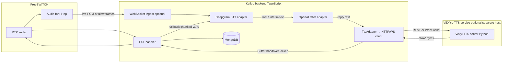

# AI voice pipeline implementation plan

> **Stack:** **Deepgram** (STT) → **OpenAI Chat Completions** (cheap model) → **VEXYL-TTS** (TTS)  
> **Target:** Kulloo (`backend/` TypeScript, FreeSWITCH + ESL). See [Documentation index](../README.md).  
> **TTS integration:** Call the **[VEXYL-TTS](https://github.com/vexyl-ai/vexyl-tts)** server from **Kulloo only** (HTTP/WebSocket client in Node). Do **not** embed TTS logic in Python inside the Kulloo repo — run `vexyl-tts` as a **separate process** or container (see local clone: `/home/mors/Code/vexyl-tts`, `vexyl_tts_server.py`).

## Goals

- Add a **real-time–ish** voice loop: caller speaks → text → model reply → spoken audio, without coupling to a single vendor’s speech-to-speech API.
- Keep **vendor boundaries clear** so STT / LLM / TTS can be swapped or extended later (adapters + normalized events).
- Persist **turns / transcripts** in MongoDB and reuse existing **Call** / **CallEvent** patterns where possible.

## Non-goals (for this phase)

- OpenAI Realtime / speech-to-speech APIs (explicitly out of scope).
- Implementing or forking **VEXYL-TTS** inside Kulloo — only **consume** its API.
- Full campaign dialer or Chati UI (future product phase).

## Architecture (high level)



**Summary**

1. **SIP/RTP** unchanged: calls land on FreeSWITCH; Kulloo controls the leg via **outbound ESL** (`socket … async full`) — see [esl.md](../esl.md).
2. **STT path:** use an **audio fork** (below) for **live** audio into Deepgram when possible; otherwise chunked `record` as fallback.
3. **LLM (OpenAI):** Chat Completions, cheap model — see provider table.
4. **TTS (VEXYL-TTS):** HTTP/WebSocket from Kulloo; hand audio to FS as **`Buffer`** (**Voice handover** — locked, not one file per utterance under recordings).

## Real-time audio: “tap” the line with an **audio fork** (recommended)

**Problem:** `record_session` writes **files** and is built for voicemail-style recording, not a **low-latency** copy of the live RTP stream. For AI that should feel conversational, you want a **continuous tap** of the same audio the caller is using.

**Solution:** Use FreeSWITCH’s **audio fork** (sometimes called a **media tap**): after the channel is answered, start a **fork** that sends a **live copy** of the audio (often **μ-law or linear PCM frames**) to a **WebSocket URL** Kulloo exposes. That WebSocket is the **ingress** for **Deepgram streaming STT**. The **main call leg is unchanged** — the caller still talks to whoever/whatever ESL is driving (hello IVR, **human agent bridge**, etc.). The fork is a **parallel path** so **user + AI** logic in Kulloo can both run: same correlation id (`channelUuid` / `callId`) ties ESL state, fork stream, and Mongo rows.

**What you have to do (checklist):**

| Step | Owner | Action |
|------|--------|--------|
| 1 | **FreeSWITCH** | Load/use the module your build provides for **forking or streaming media to WebSocket** (exact name varies: e.g. community recipes use `uuid_audio_fork`–style APIs or streaming modules — confirm against your FS version and [freeswitch.md](../freeswitch.md)). |
| 2 | **Dialplan / ESL** | After `answer`, issue the fork **for this call UUID**, pointing at **`wss://` or `ws://<kulloo-host>:<port>/...`** (or internal Docker DNS). Include **mix** of both directions if you need “what the user hears” + “what the agent/IVR plays” for debugging; for **user speech only**, fork **inbound** leg per product choice. |
| 3 | **Kulloo** | Implement a **WebSocket server** (or dedicated microservice) that: accepts the fork, **frames** match what Deepgram expects, forwards into **`SttAdapter` → Deepgram live**, correlates with **`callId`**. |
| 4 | **Network** | Ensure FS containers can reach Kulloo’s WS port (same Docker network / firewall). |
| 5 | **Human + AI** | Keep existing **WebRTC agent** / bridge behavior on the **primary** ESL flow; the **fork** only **feeds** the AI pipeline — no need to “replace” the human path unless you productize that way. |

**Fallback (MVP / dev without fork yet):** short **`record`** segments or **file chunks** → Deepgram **batch/streaming file** API — higher latency, fewer FS features, but unblocks integration before the fork is wired.

### Verify FreeSWITCH can “tap” audio (run on the FS host)

On a machine where **FreeSWITCH is running** and **`fs_cli`** is available (e.g. inside the `fs1` / `fs2` container from [`Docker/docker-compose.yml`](../../Docker/docker-compose.yml)):

```bash
fs_cli -x "show modules" | grep -i stream
fs_cli -x "show modules" | grep -i fork
```

- **If you see lines** matching your build’s streaming/fork module names, note them in the runbook and confirm they are also **loaded** in [`freeswitch/conf/freeswitch.xml`](../../freeswitch/conf/freeswitch.xml) (`<load module="…"/>`).
- **If `grep` returns nothing**, the module may be **absent** from that image, **not loaded**, or named differently — search the full list: `fs_cli -x "show modules" | grep -i audio`.
- **CI / agent environments** without a running FS cannot run this check; run it once on staging before locking the audio-fork design.

## Provider choices (locked for this plan)

| Layer | Provider | Notes |
|-------|-----------|--------|
| **STT** | **Deepgram** | Streaming or utterance-based; `DEEPGRAM_API_KEY` in env. |
| **LLM** | **OpenAI Chat Completions** | Cheap model via `AI_LLM_MODEL` (e.g. `gpt-4o-mini`); `OPENAI_API_KEY` in env. |
| **TTS** | **[VEXYL-TTS](https://github.com/vexyl-ai/vexyl-tts)** (Indic Parler–based, 22+ languages) | Run **`vexyl_tts_server.py`** (or Docker) separately. Kulloo uses **TypeScript** `fetch` / WebSocket client only. Optional `X-API-Key` if `VEXYL_TTS_API_KEY` is set on the server. For telephony, consider `VEXYL_TTS_SAMPLE_RATE=8000` on the TTS server side to align with narrowband if needed — see VEXYL-TTS README. |

**Secrets:** centralize in `backend/src/config/env.ts` ([backend-folder-structure.md](../backend-folder-structure.md)): `DEEPGRAM_API_KEY`, `OPENAI_API_KEY`, `AI_LLM_MODEL`, and VEXYL base URL + optional API key — **never** in client or committed files.

## Audio “resolution” contract (sample rates must match)

**Problem:** Telephony is often **narrowband 8 kHz** (PSTN, many SIP legs). AI stacks often default to **16 kHz**, **24 kHz**, or **44.1 kHz** PCM. If you treat bytes from one rate as another—e.g. play a **44.1 kHz** WAV as if it were **8 kHz**, or stream **8 kHz** audio into a path expecting **16 kHz**—you get **wrong speed** (chipmunk / slow motion), distortion, or **no playback**.

**Rule:** Pick **one canonical rate per hop**, document it, and **resample explicitly** at boundaries. Do not assume FreeSWITCH or Node “figures it out.”

### Contract table (fill in concrete values during implementation)

| Stage | Typical rate | Encoding / container | Who normalizes |
|--------|----------------|-------------------------|----------------|
| **Carrier / PSTN leg** | **8 kHz** narrowband | Often **G.711 μ-law** (PCMU) in RTP | Codec negotiated at SIP/RTP; FS decodes to linear for internal use. |
| **FreeSWITCH internal / ESL** | Match negotiated leg or **8 kHz / 16 kHz** linear | PCM inside FS for processing | FS + dialplan; see [freeswitch.md](../freeswitch.md), `vars*.xml`. |
| **Audio fork → Kulloo** | **Must be fixed in runbook** (e.g. **8 kHz** linear or μ-law frames) | Document **exact** fork API (frame size, endianness) | **Kulloo** converts to what **Deepgram** expects if different. |
| **Deepgram STT** | **8 kHz** or **16 kHz** per project/API | Linear PCM or specified container | Set Deepgram **encoding + sample_rate** in API; no guessing. |
| **VEXYL-TTS output** | **`VEXYL_TTS_SAMPLE_RATE`** — use **8000** for telephony alignment, or native **~44.1 kHz** then **resample** | WAV from API | **Either** configure VEXYL for **8 kHz** output **or** resample in Kulloo before `playback`. |
| **Playback on FS** | **Must match** WAV/file rate FS expects for the command you use | `playback` of WAV | If mismatch: chipmunk/wrong speed — **resample** to FS leg rate first. |

### Design checklist

1. **Write down** the fork’s output: `Fs Hz`, `mono/stereo`, `signed 16-bit LE`, or μ-law — one paragraph in the runbook.
2. **Deepgram:** set `sample_rate` + `encoding` to match what you send (after any Kulloo conversion).
3. **VEXYL-TTS:** set `VEXYL_TTS_SAMPLE_RATE=8000` **or** always resample WAV in Kulloo to the **same** rate as the **FreeSWITCH leg** used for `playback`.
4. **WebRTC / agent bridge** (if concurrent): wideband may be **16 kHz** — a **second** contract row; do not mix bytes between NB and WB without conversion.
5. **Test tone:** play a known-length beep at each stage; if duration/speed is wrong, fix **rate** before fixing prompts.

### Env / config knobs (illustrative)

- `AI_AUDIO_FORK_SAMPLE_RATE`, `AI_PLAYBACK_SAMPLE_RATE` (Kulloo — single source of truth for the pipeline).
- `VEXYL_TTS_SAMPLE_RATE` (VEXYL server — align with playback or resample after).
- Deepgram connection: `sample_rate` matching fork or chunk pipeline.

## Prompts & personality (system instructions — not buried in code)

**Problem:** Strings like *“You are a helpful support agent…”* belong to **product**, not to a random branch inside `esl-call-handler.service.ts`. Hiding them in code makes **tone changes** risky (merge conflicts, accidental logic breaks) and blocks **non-developers** from editing copy.

**Fix:** Keep **all** fixed LLM instructions (system prompt, guardrails, style) in **dedicated prompt files** (or a small prompt module that **only** loads text). Application code **imports** or **reads** these at startup / per session — it does **not** concatenate paragraphs of personality inline.

### How similar systems do it (reference only)

| System | Pattern (conceptual) | Where to look |
|--------|----------------------|---------------|
| **Bolna** | Central **Python module** of prompt strings: summarization, completion check, voicemail detection, language detection, extraction — **one file** to edit behavior without touching orchestration. | `bolna/prompts.py` |
| **Jambonz** | **Personality / model instructions** are **not** hardcoded in the feature server core. Your **application** returns verbs (e.g. `llm` with **`llmOptions`** such as OpenAI **`session_update`** / **`response_create`**) from your **webhook** — prompts live with **app config**, versioned with your integration. | App webhook JSON + `jambonz-feature-server/lib/tasks/llm/` (execution only) |

### Kulloo — concrete approach (MVP)

| Item | Recommendation |
|------|----------------|
| **Location** | `backend/src/prompts/ai-voice/` (or `backend/prompts/` at package root) — **one file per persona** or one file with named exports, e.g. `system-support.md`, `system-default.md`, or `system.ts` that exports `SYSTEM_PROMPT_SUPPORT` as plain strings. |
| **Format** | Prefer **`.md` or `.txt`** for long text (readable in PRs) **or** a thin **`prompts.ts`** that **only** exports constants / `as const` — **no** business logic beside loading. |
| **Loader** | `getAiSystemPrompt(personaId: string): string` reads from the file map; default persona from env **`AI_VOICE_PERSONA`** (e.g. `support`). |
| **Usage** | `LlmAdapter` / conversation service passes **`{ role: "system", content: getAiSystemPrompt(...) }`** as the **first** message to OpenAI Chat — same pattern everywhere (hello path, summary, optional tools). |
| **Forbidden** | Multi-paragraph system prompts **inline** in `esl-call-handler.service.ts`, `call.service.ts`, or controllers — only **import** from `prompts/`. |
| **Later** | Per-tenant prompts from **Mongo** or admin UI — still **load into** the same `getAiSystemPrompt` boundary so call sites stay unchanged. |

### Phase alignment

- **Phase 1:** Create `backend/src/prompts/ai-voice/` + env `AI_VOICE_PERSONA` (and optional `AI_SYSTEM_PROMPT_FILE` override for ops).
- **Phase 3:** ESL / AI coordinator uses **only** the loader for system messages.

## Short-term memory (sliding window) — token budget

**Problem:** As a call gets longer, sending **the full transcript** to OpenAI on every request makes responses **slower**, **more expensive**, and can hit **context limits**. You need an explicit rule for what the model is allowed to “remember” during the live call.

**Choice for telephony (default): sliding window — drop the oldest turns.** Do **not** rely on “summarize mid-call” for v1; that adds latency and failure modes on the hot path.

### Rule (pinned system + last N messages)

```
[system prompt]              ← always kept (from prompts/ loader)
[user]        … oldest dropped first when over limit
[assistant]
…
[user]        … most recent
[assistant]
```

- Build the OpenAI **messages** array as: **`[system]`** + **alternating `user` / `assistant`** chunks for the live conversation.
- **`AI_HISTORY_MAX_TURNS`** (default **`10`**) = maximum number of **non-system** chat **messages** to keep (typical alternating flow ≈ **5 user + 5 assistant** = **10** messages). When the list would exceed this, **remove the oldest pair** (oldest `user` + oldest `assistant` after system) and repeat until within the cap.
- **`LlmAdapter`** applies this **clip** inside **`complete()`** (or immediately before every OpenAI request) so **callers cannot forget** — one enforced policy.

**Not chosen for live path (v1):** rolling **summarization** of the start of the call to shrink context. That can be a **future** option if product needs long-call recall without raising `AI_HISTORY_MAX_TURNS`; for now, **sliding window only**.

### After the call: optional summary for operators

- **`AI_SUMMARY_ON_HANGUP`** (default **`true`**): when the call **ends**, enqueue an **asynchronous** job (user is **not** waiting) that runs a **separate** LLM call with the **full** stored transcript (or Mongo turns) to produce a **short operator summary** for CRM / Phase 5 APIs.
- This gives **best of both worlds**: **fast + cheap** live loop (windowed history), **rich** post-hoc summary for humans.

### Env vars (Phase 1)

| Variable | Default | Meaning |
|----------|---------|---------|
| `AI_HISTORY_MAX_TURNS` | `10` | Max **non-system** messages in the sliding window (drop oldest **pairs** when over). |
| `AI_SUMMARY_ON_HANGUP` | `true` | If true, run **async** summarization after hangup for operators (Phase 5); does not block the caller. |

## Voice handover (TTS → FreeSWITCH): **buffer** (locked in)

**Problem:** After VEXYL-TTS (or any TTS) produces audio, it must reach the **phone leg** via FreeSWITCH/ESL. Two styles exist: hand over a **finished file path** on disk, or hand over **live bytes** (**`Buffer`** / in-memory audio). Mixing both in the design invites inconsistent cleanup, **thousands of tiny `.wav` files**, and disk churn.

**Choice (locked): use an in-memory `Buffer` as the default handover.** The **`TtsAdapter`** returns **`Buffer`** (WAV or raw PCM per your contract — see **Audio “resolution” contract**). Downstream code feeds FreeSWITCH **without** persisting each assistant utterance under `RECORDINGS_DIR` or other long-lived paths.

| Approach | Status |
|----------|--------|
| **`Buffer` → ESL / FS playback** | **Default.** Keep audio in memory; pass into whatever FS API you use (`playback` wrapper, temp pipe, or a **single-use** temp file that is **deleted immediately** after playback starts — implementation detail, not the product contract). |
| **Permanent “drop a file per sentence” under recordings/** | **Not** the default for AI TTS — that path is for **human-facing recordings** / compliance, not for every model reply. |

**Why buffer wins:** avoids **save + delete** storms, simpler **barge-in** (discard the buffer / cancel queued playback), fewer **race** conditions with the filesystem on busy systems.

**Implementation note:** If your chosen ESL primitive **only** accepts a **file path**, still treat the **contract** as buffer-first: write to **`os.tmpdir()`** / a **per-call** scratch file that is **overwritten or removed** each turn — do **not** design around accumulating one new permanent file per utterance.

## Barge-in and interruption — how the AI “shuts up” (step-by-step)

When the user says **“Wait, stop!”** while the agent is speaking, three subsystems must move together: **voice** (stop sound), **brain** (cancel or discard pending cognition), **ears** (listen for a **new** utterance without blending with stale STT). This is harder than a single `if` because playback, HTTP to OpenAI, and STT buffers are **concurrent**.

### How similar systems do it (reference only)

| System | Pattern (conceptual) | Where to look in source |
|--------|----------------------|-------------------------|
| **Bolna** | **Turn / sequence IDs** so late TTS audio can be **BLOCK**ed; **InterruptionManager** tracks whether the callee is speaking, grace delays, and when to treat STT as an interrupt (`should_trigger_interruption`, word-count threshold, optional phrases). Audio send path asks **SEND vs WAIT vs BLOCK** before shipping synthesized audio to the wire. | `bolna/agent_manager/interruption_manager.py` |
| **Jambonz** | Stop media on the FreeSWITCH leg with **`uuid_break`** on the channel UUID; streaming TTS uses a **flush** command to clear queued speech (`TtsStreamingBuffer` → `flush` / API to FS). | `jambonz-feature-server/lib/tasks/say.js` (`uuid_break`), `lib/utils/tts-streaming-buffer.js` (`flush`) |

Kulloo is **not** Bolna or Jambonz, but the **same separation of concerns** applies: *invalidate the playback leg*, *invalidate in-flight LLM/TTS work*, *reset or label STT so the next transcript is a fresh turn*.

### Kulloo — ordered “shut up” plan (implement in one coordinator per `callId`)

**Invariant:** Maintain a monotonic **`ai_turn_id`** (or sequence id). Any audio/LLM work tagged with an **old** id is **discarded** when an interrupt fires.

| Step | Subsystem | Action |
|------|-----------|--------|
| **1** | **Voice (FreeSWITCH + ESL)** | On interrupt signal, call FS **`uuid_break`** on the **channel UUID** (same pattern as Jambonz) to **stop current `playback`** immediately. If you later use **streaming TTS** into FS, also **flush** that pipeline per your FS integration. |
| **2** | **Voice (Kulloo)** | Cancel any **queued** playback (**buffers** / not-yet-started play steps). Do not rely only on FS — both sides should agree. |
| **3** | **Brain (OpenAI)** | **`AbortController`** (or equivalent) on the **in-flight Chat Completions** request; await abort and **drop** partial assistant text — do **not** append half a sentence to history. |
| **4** | **Brain (memory)** | Optionally append nothing, or append a **system or user line** like “(user interrupted)” **only if** product wants it; otherwise **truncate** the partial assistant message from the **in-memory** message list. |
| **5** | **Ears (Deepgram)** | Mark the current STT **utterance / stream** as **superseded**: either **close** the live stream and **open** a new one, or tag results with **`ai_turn_id`** and **ignore** finals until they match the **post-interrupt** id (Bolna-style **sequence** invalidation). |
| **6** | **Ears (trigger)** | Decide **when** to fire interrupt: e.g. **interim** transcript contains ≥ *N* words **or** matches a phrase list (“stop”, “wait”) **while** `agent_is_speaking === true` (Bolna-style `should_trigger_interruption`). Tune *N* to avoid accidental cuts from noise. |
| **7** | **Re-arm** | Set **`agent_is_speaking = false`**, increment **`ai_turn_id`**, resume listening — next user speech starts a **new** turn. |

### State you should track (minimum)

- `agent_is_speaking: boolean` — true from start of TTS/playback until `uuid_break` + playback-ended event (or timeout).
- `ai_turn_id: number` — bump on every successful interrupt and optionally on each new assistant reply.
- `inFlightLlm: AbortController | null` — abort on interrupt.
- `deepgramSessionId` or **logical stream generation** — so stale finals never commit after interrupt.

### Phase alignment

- Implement the coordinator in **Phase 3** alongside the main loop; **Phase 4** can refine timings (debounce, grace period like Bolna’s `incremental_delay`).

## Implementation phases

### Phase 1 — Contracts and config

- **Prompts:** add `backend/src/prompts/ai-voice/` (or equivalent) and **Prompts & personality** above — no system text in ESL/services beyond imports.
- Env vars (illustrative): `DEEPGRAM_API_KEY`, `OPENAI_API_KEY`, `AI_LLM_MODEL` (default cheap model), `AI_VOICE_PERSONA`, **`AI_HISTORY_MAX_TURNS`** (default `10`), **`AI_SUMMARY_ON_HANGUP`** (default `true`), `VEXYL_TTS_BASE_URL` (or `VEXYL_TTS_HOST` + port), optional `VEXYL_TTS_API_KEY` for the `X-API-Key` header when the TTS server requires it.
- Define **TypeScript interfaces** in backend (`src/services/ai/` suggested):
  - `SttAdapter`: Deepgram-backed; `startSession(callContext) → AsyncIterable<SttEvent>`
  - `LlmAdapter`: OpenAI Chat; `complete(messages, options) → { text, usage? }` — **must** apply **sliding-window clip** to `messages` (after pinned `system`) per **`AI_HISTORY_MAX_TURNS`** before each request (**Short-term memory** above).
  - `TtsAdapter`: **HTTP/WebSocket client to VEXYL-TTS**; `synthesize(text) → Buffer` (WAV/PCM per contract) — **buffer handover** to FS; see **Voice handover**.
- Document correlation: reuse **`callId` / `channelUuid`** from ESL for logs and Mongo writes.

### Phase 2 — Audio path from FreeSWITCH to Kulloo (audio fork first)

- **Primary:** Enable and invoke **FreeSWITCH audio fork / media tap** → **WebSocket URL on Kulloo** → frames forwarded to **Deepgram live** STT (see section *Real-time audio* above).
- **Today’s hello flow** uses `record_session` + WAV files ([esl.md](../esl.md)) — keep that only as **fallback** or for compliance recording, not as the main AI ingress if you want low latency.
- **Fallback for v1:** short **record chunks** or VAD-segmented files → Deepgram STT until the fork + WS ingest is stable.

### Phase 3 — Conversation loop (ESL)

- In `esl-call-handler.service.ts` (or a dedicated service it calls):
  1. `answer` the channel.
  2. Optional greeting: **VEXYL-TTS** short line + `playback`.
  3. Loop until hangup:
     - User speech → **Deepgram** STT → **final** transcript for the turn.
     - Append user message; persist turn if schema is ready.
     - **OpenAI Chat** with system prompt + **sliding-window** history (`AI_HISTORY_MAX_TURNS`); see **Short-term memory**.
     - **VEXYL-TTS** on assistant text → **`Buffer`** → hand to FS (**Voice handover**); no permanent per-utterance recording files for AI speech.
     - On **barge-in**: follow **Barge-in and interruption** above (`uuid_break`, abort LLM, invalidate STT turn, bump `ai_turn_id`).
  4. On hangup: mark call completed; if **`AI_SUMMARY_ON_HANGUP`**, enqueue **async** summarization (full transcript / Mongo turns) for operators — **do not** block hangup on this LLM call.

### Phase 4 — Latency and quality

- Streaming Deepgram STT where possible.
- Optionally stream LLM tokens and feed TTS **sentence-by-sentence** (harder; after baseline).
- Metrics: **speech end → start of playback** (p50/p95).

### Phase 5 — Persistence and API

- Mongo: `turns[]` or collection: `{ role, text, ts, sttLatencyMs?, llmLatencyMs?, ttsLatencyMs? }` — store **full** turns for compliance and for **post-call** summary (even though the **live** LLM uses a sliding window).
- Optional: `GET /api/calls/:id/transcript` ([api.md](../api.md) style).
- If **`AI_SUMMARY_ON_HANGUP`**: persist **`summary`** / **`operatorSummary`** on `Call` (or a side collection) from the **async** summarization job; expose on transcript/detail endpoints as needed.

## Risks and mitigations

| Risk | Mitigation |
|------|------------|
| VEXYL-TTS latency / GPU | Run TTS on a capable host or GPU; keep server close to Kulloo on the network; cache repeated phrases (VEXYL has LRU cache). |
| Chunked STT feels sluggish | Prefer **audio fork** → Kulloo WS → Deepgram live; tune frame size / codec. |
| FS module / API differs by version | Lock FS version in runbook; test fork on staging before prod. |
| LLM latency | Short prompts; cheap model; cap history. |
| Sample-rate mismatch | Follow **Audio “resolution” contract** above; never play high-rate WAV on an 8 kHz leg without resampling. |
| Interrupt races (STT final arrives after user already interrupted) | **Turn ids** + discard stale finals; optional Bolna-style word threshold. |

## Definition of done (MVP)

- [ ] **VEXYL-TTS** running and reachable from Kulloo (Docker Compose or separate VM).
- [ ] Inbound call → answered → **audio fork** (or agreed fallback) → user speaks → **Deepgram** STT → **OpenAI** reply → **VEXYL-TTS** audio played back on FS.
- [ ] At least **one full exchange** persisted in Mongo with correlation to `Call`.
- [ ] Keys only in server env; no secrets in repo.
- [ ] Runbook: env vars, Deepgram project, OpenAI model name, VEXYL URL + optional API key, test call steps.
- [ ] **Barge-in:** user can interrupt TTS with a short phrase; playback stops, LLM aborted, next user turn clean (see **Barge-in and interruption**).

## References

- [esl.md](../esl.md) — outbound ESL, `executeCallFlow`
- [freeswitch.md](../freeswitch.md) — `socket` dialplan
- [hello-call-contract.md](../hello-call-contract.md) — hello baseline before AI
- [backend-folder-structure.md](../backend-folder-structure.md) — where to add `ai` services
- VEXYL-TTS repo (local): `/home/mors/Code/vexyl-tts` — `README.md`, `vexyl_tts_server.py`, REST + WebSocket APIs
- **Bolna** (reference): `bolna/agent_manager/interruption_manager.py` — interruption / audio gate; `bolna/prompts.py` — centralized LLM prompt strings.
- **Jambonz** (reference): `jambonz-feature-server/lib/tasks/say.js` — `uuid_break`; `lib/utils/tts-streaming-buffer.js` — TTS flush. App **webhook** returns the `llm` verb with **`llmOptions`** (e.g. OpenAI session/update) — personality lives in **your app**, not in the feature server core.

---

*Stack: Deepgram STT → OpenAI Chat (cheap model) → VEXYL-TTS → **Buffer** handover to FS. Prompts: `backend/src/prompts/ai-voice/`. Memory: sliding window `AI_HISTORY_MAX_TURNS`; async summary if `AI_SUMMARY_ON_HANGUP`. Barge-in: FS `uuid_break` + abort LLM + STT turn invalidation.*
