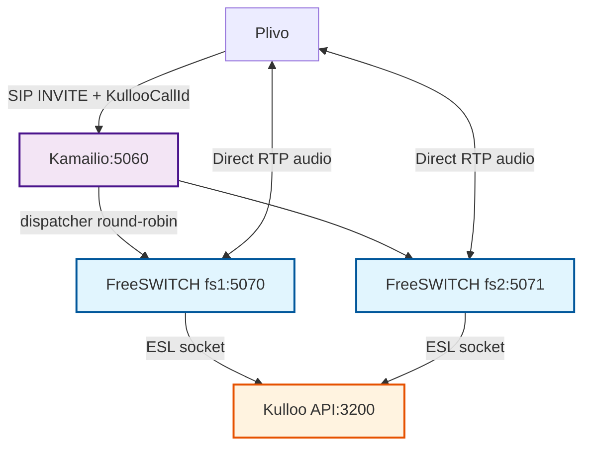
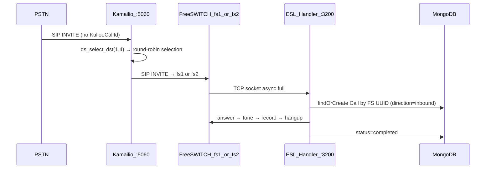

# Kamailio in Kulloo

> **Doc hub:** [Documentation index](../README.md) — see also [freeswitch.md](./freeswitch.md), [esl.md](./esl.md), [outbound-calls.md](./outbound-calls.md).

This document describes how Kamailio operates as a SIP load balancer in front of the FreeSWITCH pool in Kulloo's production architecture, and why it was chosen over alternatives.

---

## 1. What Kamailio does (and does NOT do)

> [!NOTE]
> **RTP flows directly between Plivo and FreeSWITCH — Kamailio never touches audio.**

| What Kamailio does | What Kamailio does NOT do |
|--------------------|--------------------------|
| Receives all SIP INVITEs from Plivo/PSTN on port 5060 | Relay RTP audio (media) |
| Routes each INVITE to an available FreeSWITCH instance | Modify SIP headers (passes all through untouched) |
| Health-checks each FreeSWITCH via OPTIONS ping every 10s | Store call state |
| Fails over to the next FS if one instance is down | Connect to MongoDB or Redis |
| Passes `KullooCallId` and all custom SIP headers through | Participate in ESL or call control |



---

## 2. Why Kamailio (not OpenSIPS, not Drachtio)

| Option | Reason chosen / not chosen |
|--------|---------------------------|
| **Kamailio** ✅ | Lighter memory footprint than OpenSIPS for pure proxy; `dispatcher` module built-in and battle-tested; extensive community; 5.7 LTS with long support window |
| OpenSIPS | Excellent for complex routing scenarios; heavier; very similar to Kamailio but less familiar for the team |
| Drachtio | Node.js SIP framework — powerful but combines SIP + media control; Kulloo already uses ESL for media control; adding Drachtio would duplicate the control plane |
| Nginx Stream / HAProxy | Layer-4 TCP proxies, not SIP-aware; cannot do SIP health checks (OPTIONS) or SIP-level failover |

---

## 3. Kamailio modules loaded

> [!WARNING]
> **Not loaded:** `rtpproxy`, `mediaproxy`, `rtpengine` — Kamailio does not touch RTP in this deployment.

| Module | Purpose |
|--------|---------|
| `tm` | Transaction manager — reliable INVITE forwarding, timeout handling |
| `sl` | Stateless SIP reply (for OPTIONS, quick rejections) |
| `rr` | Record-Route — keeps Kamailio in the signaling path for BYE/re-INVITE |
| `maxfwd` | Manages `Max-Forwards` SIP header to prevent routing loops |
| `textops` | Text manipulation (message body, header ops) |
| `siputils` | `is_method()`, `has_totag()`, other SIP utility functions |
| `xlog` | Extended structured logging for debugging |
| `dispatcher` | **Core module**: load balancing, health checks (OPTIONS), failover |
| `mi_fifo` | Management interface for `kamctl dispatcher show/reload` |
| `pv` | Pseudo-variables (`$ru`, `$du`, `$avp`, etc.) |


---

## 4. How `KullooCallId` survives the Kamailio hop

The `KullooCallId` header is the stable spine that ties a Mongo `Call` document to the FreeSWITCH ESL session. It must survive every hop:

> [!IMPORTANT]
> **Key Insight:** `record_route()` in kamailio.cfg adds a Route header but does NOT modify the custom `KullooCallId` header or any `X-PH-*` headers.

1. Kulloo API creates Call._id = `507f1f77bcf86cd799439011` (24-hex ObjectId)
2. TelephonyAdapter calls Plivo REST:
   `sipHeaders = "KullooCallId=507f1f77bcf86cd799439011"`
   → Plivo puts this in the SIP INVITE as header: `KullooCallId: 507f1f77bcf86cd799439011` (Plivo also echoes as `X-PH-KullooCallId` on HTTP callbacks)
3. Plivo hits Answer URL → `sendPlivoAnswerXml` returns:
   ```xml
   <Dial sipHeaders="KullooCallId=507f1f77bcf86cd799439011">
     <User>sip:1000@kamailio:5060</User>
   </Dial>
   ```
   → Plivo sends SIP INVITE to Kamailio with `KullooCallId` header
4. Kamailio: `record_route()` + `ds_select_dst()` + `t_relay()`
   → Forwards INVITE to fs1 or fs2 — **ALL headers passed through untouched**
   → `KullooCallId: 507f1f77bcf86cd799439011` arrives at FreeSWITCH
5. FreeSWITCH dialplan: matches `1000` → `socket api:3200 async full`
6. ESL handler (`esl-call-handler.service.ts`):
   - `extractKullooCallId()` finds "KullooCallId" header (case-insensitive search)
   - `findCallDocumentByStableCallId("507f1f77bcf86cd799439011")`
   - Updates `Call` document: `providerCallId` = `<FS channel UUID>`
   - Runs hello flow: answer → tone → record → DTMF → hangup → completed

---

## 5. Port plan

| Service | Container Port | Host Port | Protocol | Notes |
|---------|---------------|-----------|----------|-------|
| Kamailio | `5060` | `5060` | UDP + TCP | Receives from Plivo/PSTN |
| fs1 | `5070` | `5070` | UDP + TCP | Receives from Kamailio |
| fs2 | `5070` | `5071` | UDP + TCP | Different host port, same container port |
| fs1 RTP | `16384–17383` | `16384–17383` | UDP | 500 concurrent streams |
| fs2 RTP | `17384–18383` | `17384–18383` | UDP | 500 concurrent streams |
| Kulloo API | `5000` | `5000` | TCP | HTTP API |
| ESL outbound | `3200` | `3200` | TCP | ALL FS instances connect here |
| FS ESL (classic) | `8021` | `8021/8022` | TCP | Optional tooling |

---

## 6. RTP port allocation (per instance)

> [!CAUTION]
> The `ext-rtp-ip` variable in `vars.fs1.xml` / `vars.fs2.xml` **MUST** be the server's public IP. FreeSWITCH includes this in SDP so Plivo knows where to send audio. Wrong value = **silent calls / no audio**.

Each FreeSWITCH instance gets a **non-overlapping** UDP port range for RTP. Since both fs1 and fs2 run on the **same server**, their RTP ports must not collide on the host.

- **fs1:** UDP `16384 – 17383`  (1000 ports ÷ 2 = 500 concurrent streams)
- **fs2:** UDP `17384 – 18383`  (1000 ports ÷ 2 = 500 concurrent streams)
- **Total:** 1000 concurrent streams across 2 instances

To add a third unit (fs3):
- **fs3:** UDP `18384 – 19383`

---

## 7. Outbound call flow (full sequence with Kamailio)

```mermaid
sequenceDiagram
  participant Client
  participant API as Kulloo_API
  participant Mongo as MongoDB
  participant Plivo
  participant KAM as Kamailio_:5060
  participant FS as FreeSWITCH_fs1_or_fs2
  participant ESL as ESL_Handler_:3200

  Client->>API: POST /api/calls/outbound/hello + Idempotency-Key
  API->>Mongo: Create Call (_id=KullooCallId, status=initiated)
  API->>Plivo: calls.create(.., answerUrl+?kullooCallId=..., sipHeaders=KullooCallId=...)
  Plivo-->>API: requestUuid
  API->>Mongo: upstreamProvider=plivo, status=connected
  API-->>Client: 200 { call, recordings:[] }

  Note over Plivo: PSTN rings; callee answers
  Plivo->>API: GET PLIVO_ANSWER_URL?kullooCallId=<id>
  API-->>Plivo: XML Dial sipHeaders KullooCallId → sip:1000@kamailio:5060

  Plivo->>KAM: SIP INVITE sip:1000@kamailio:5060 (KullooCallId header present)
  KAM->>KAM: ds_select_dst(1,4) → selects fs1 or fs2 (round-robin)
  KAM->>FS: SIP INVITE sip:1000@fs1:5070 (ALL headers forwarded untouched)

  Note over Plivo,FS: RTP audio flows Plivo ↔ FreeSWITCH DIRECTLY (not through Kamailio)

  FS->>ESL: TCP socket async full (dialplan: socket api:3200)
  ESL->>Mongo: findByStableCallId(KullooCallId) → patch providerCallId=FS_UUID
  ESL->>FS: answer → sleep → tone → record_session → DTMF wait
  ESL->>Mongo: status events, recording metadata
  ESL->>FS: stop_record → hangup
  ESL->>Mongo: status=completed, Recording=completed
```

---

## 8. Inbound call flow



---

## 9. Health checks and failover

> [!TIP]
> If **ALL** FreeSWITCH instances go down, Kamailio will return `503 Service Unavailable` directly to Plivo rather than timing out.

- Kamailio sends **OPTIONS** to each FS every **10 seconds** (`ds_ping_interval=10`)
- After **3 consecutive failures** (`ds_probing_threshold=3`), FS is marked **inactive**
- Active FS instances are auto-detected for new INVITEs
- Recovery: once FS responds to OPTIONS successfully, it re-enters the rotation

```bash
# Check live dispatcher state
docker exec kulloo-kamailio kamctl dispatcher show

# Force reload after editing dispatcher.list (no restart)
docker exec kulloo-kamailio kamctl dispatcher reload
```

---

## 10. Environment variables

| Variable | Required | Purpose |
|----------|----------|---------|
| `KAMAILIO_SIP_URI` | Yes (in Kamailio mode) | SIP URI Plivo dials. Example: `sip:1000@148.135.138.190` |
| `KAMAILIO_HOST` | Optional | Kamailio hostname for logging/health checks |
| `FREESWITCH_SIP_URI` | Fallback | Used if `KAMAILIO_SIP_URI` is not set (direct FS mode) |
| `FREESWITCH_INSTANCES` | Optional | Comma-list of FS instances for monitoring: `fs1:5070,fs2:5071` |

No changes to ESL, Redis, MongoDB, or recording configuration are required.

---

## 11. Related documentation

- [freeswitch.md](./freeswitch.md) — Multi-instance FS setup, SIP port 5070, context mrf
- [esl.md](./esl.md) — ESL outbound socket pattern (unchanged for Kamailio)
- [outbound-calls.md](./outbound-calls.md) — Updated sequence with Kamailio
